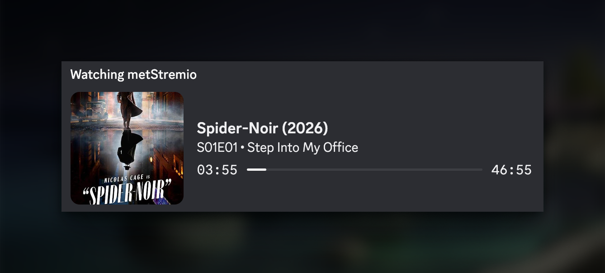
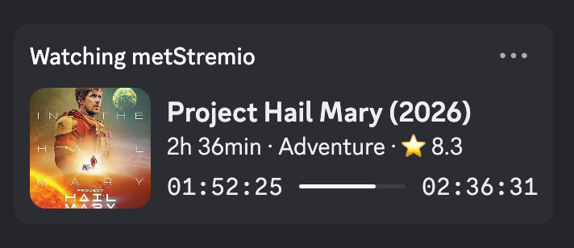

<p align="center">
    <!-- 🔁 Replace with your own logo -->
    
</p>

<h1 align="center">metStremio</h1>

<p align="center">
  <strong>Discord Rich Presence for Stremio.</strong>
  <br />
  A companion app for Stremio that detects playback in real time and syncs it to Discord Rich Presence with clean, native system integration.
</p>
<p align="center">
  
  
  
  
  
  
</p>

---

## ✨ What is metStremio?
**metStremio** is a *local Stremio companion app* that detects your playback activity and syncs it with **Discord Rich Presence**.

It doesn’t stream anything or provide content as it simply monitors what you’re watching on your machine and updates your Discord status in real time.

- **Runs locally** on your machine  
- **Syncs playback** with Discord Rich Presence  
- Supports *movies and series* in Stremio  
- Lightweight **background process**  
- No streaming or content handling.. just *activity tracking*

---

## 🎨 Preview
<p align="center">
    <!-- 🔁 Replace with your own preview -->
    
    
</p>

---

### 🖥️ Operating System
| OS | Description | Support |
|----|-------------|---------|
| [Windows](https://github.com/metstremio/windows) | Active development version. New features and improvements are being built there. | ⚠️ In Development |
| [macOS](https://github.com/metstremio/macos) | Fully working stable version with native integration and accessibility-based detection. | ✅ Stable |
| [Linux](https://github.com/metstremio/linux) | Not supported yet (planned for future updates). | ❌ N/A |
| [Android](https://github.com/metstremio/android) | Not supported yet (planned for future updates). | ❌ N/A |
| [iOS](https://github.com/metstremio/ios) | Not supported yet (planned for future updates). | ❌ N/A |


---

## 🐞 Known Issues
- Waiting for more bugs... xD

---

> [!NOTE]
> metStremio uses the OMDb API for movie and series metadata (titles, posters, descriptions).
> To enable these features, add your API key to your `.env` file.
> You can get a free key here: https://www.omdbapi.com/apikey.aspx

> [!WARNING]
> **Keep your key private and NEVER commit it to GitHub.**

---

## 🤝 Contributing

Contributions are welcome as this is an open-source project and any help is appreciated.

### How to contribute

1. Fork the project  
2. Create your feature branch  
   ```bash
   git checkout -b feature/AmazingFeature
   ```
3. Commit your changes
   ```bash
   git commit -m 'Add some feature'
   ```
4. Push to the branch
   ```bash
   git push origin feature/AmazingFeature
   ```
5. Open a Pull Request

 ---
 
## 📬 Contact

If you need help, want to report an issue, or just want to talk about the project:

- 💬 Discord Server → https://discord.metloub.com  
- 📧 Email → business@metloub.com  
- 👤 Discord → @floptropica  

---

## ✨ Donate

metStremio is a project I’m building and maintaining.
If you like it:
- ⭐ Star the repository
- 🗣 Share it with others
- ☕ Buy me a Ko-Fi → https://ko-fi.com/met

---

<h2 align="center"> ⭐ Star History</h2>

<a href="https://www.star-history.com/?repos=metStremio%2F.github&type=date&legend=top-left">
 <picture>
   <source media="(prefers-color-scheme: dark)" srcset="https://api.star-history.com/chart?repos=metStremio/.github&type=date&theme=dark&legend=top-left" />
   <source media="(prefers-color-scheme: light)" srcset="https://api.star-history.com/chart?repos=metStremio/.github&type=date&legend=top-left" />
   
 </picture>
</a>

---

## 📄 License

metStremio is an open-source project released under the [MIT License](LICENSE).

This means you are free to:

- Use the project for personal or commercial purposes  
- Modify the source code however you like  
- Distribute copies of the project  
- Include it in your own projects  

There are only a few simple conditions:

- You must include the original license notice  
- You must credit the original project when redistributing  
- The software is provided “as is”, without warranty of any kind  

---

### ⚖️ Disclaimer

This project is provided in good faith, but without any guarantees.

The author is not responsible for:
- Any issues caused by usage of the software  
- Data loss or system problems  
- Misuse of the project or its features  

**Use it at your own risk.**
